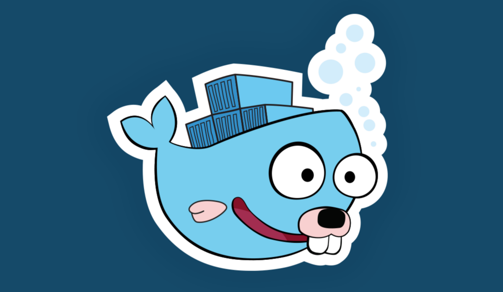
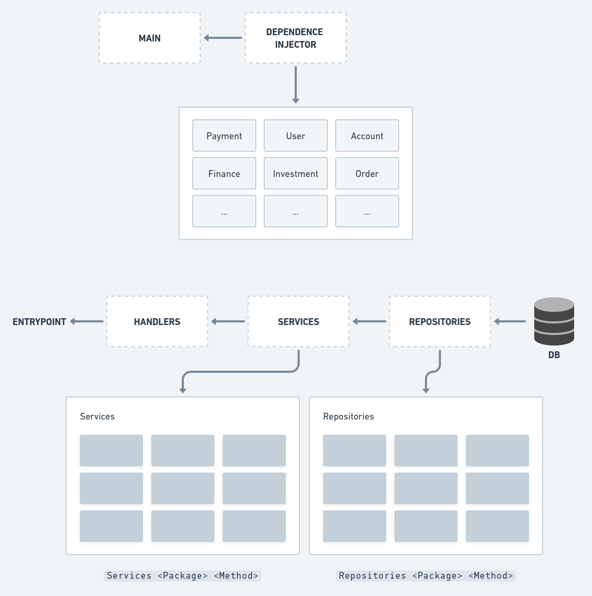

<p align="center">
  
</p>

# Container Pattern

## Overview

This application implements the Container Pattern.

- [x] Container Pattern
- [x] Fiber
- [x] Postgres
- [x] Gorm

---

### Container pattern

A Container is an object created to hold other objects that are accessed, this way injecting a dependency is very easy.

The `repositories` receive the `database`, and this database is injected as a dependency in each repository.

The `services` receive the `repositories` and these repositories are injected as a dependency on each service.

The `handlers/controllers` receive these `services` and each handler/controller is given the necessary service.

This pattern helps a lot, in addition to maintaining an organization, it guarantees a very high consistency in your codebase.



### Install dependencies

```bash
$ go mod tidy
```

### Configure .env

Fill the `.env` file with the correct values to connect to the Postgresql database.

```bash
$ cp .env.example .env
```

### Run app

```bash
$ go run cmd/api/main.go
```

Now send a POST request to verify that the body data has been saved:

> http://localhost:3333/installment

```json
{
  "id": "1",
  "value": 10.1,
  "due_day": 30
}
```
